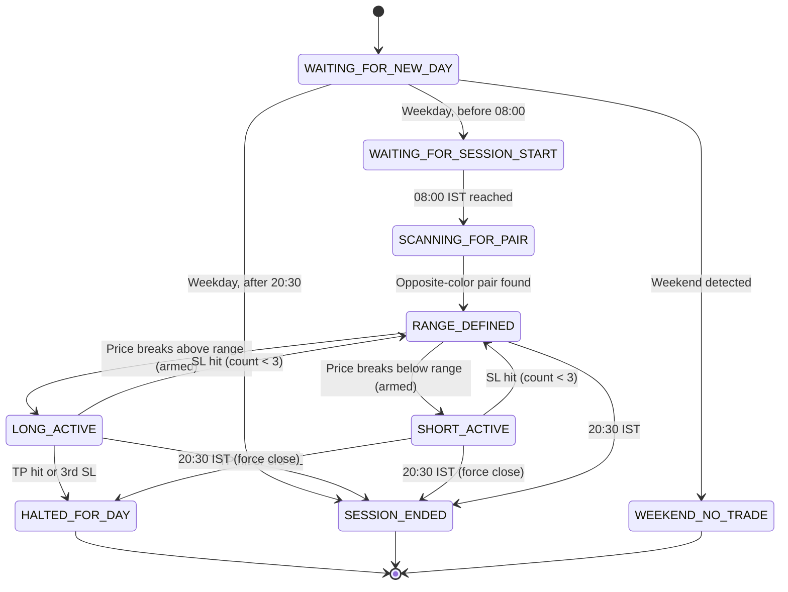

# 📈 BTC-USDC 5-Minute Breakout Strategy — Live Trading System

> **Asset**: BTC-USDC Perpetuals  
> **Exchange**: Hyperliquid  
> **Timeframe**: 5-Minute Candles  
> **Timezone**: IST (Asia/Kolkata)  
> **Leverage**: 1x Cross  

---

# Part I — Business Logic

*For market traders and strategy analysts.*

---

## 1. Strategy Overview

This is a **morning range breakout strategy** that operates on BTC-USDC 5-minute candles during the IST trading session. The core philosophy is simple:

> *"Let the market show you its morning indecision, draw a box around it, and trade the first decisive move that breaks out of that box."*

The strategy has **no discretionary judgment**. Every rule — from range identification to entry, stop-loss, take-profit, and daily halt — is fully codified and executed automatically.

---

## 2. The Trading Session

| Parameter | Value |
|-----------|-------|
| **Session Open** | 08:00 IST |
| **First Trade Allowed** | 08:10 IST |
| **Session Close** | 20:30 IST |
| **Trading Days** | Monday – Friday (weekdays only) |

The bot wakes up at **08:00 IST** and begins scanning. No trades are placed before **08:10 IST** — this 10-minute buffer ensures at least two 5-minute candles have closed before any range can be defined.

If a trade is still open when the session ends at **20:30 IST**, it is **forcibly closed at market price**.

---

## 3. Range Identification — "The Box"

The range is the foundation of the strategy. Here's how it's built:

### 3.1 The Rule: First Opposite-Color Pair

Starting at 08:00 IST, the bot scans every closed 5-minute candle looking for the **first pair of consecutive candles with opposite colors**:

- 🟢 **Green candle** → Close > Open (bullish)
- 🔴 **Red candle** → Close < Open (bearish)

A valid pair is either:
- 🟢 Green followed by 🔴 Red
- 🔴 Red followed by 🟢 Green

### 3.2 Drawing the Box

Once a valid pair is found, the **range box** is drawn using the combined highs and lows of both candles:

```
Range High = max(Candle1.High, Candle2.High)
Range Low  = min(Candle1.Low,  Candle2.Low)
Range Size = Range High − Range Low
```

### 3.3 Example

Suppose the first two 5-minute candles after 08:00 IST are:

| Candle | Open | High | Low | Close | Color |
|--------|------|------|-----|-------|-------|
| 08:00–08:05 | 70,100 | 70,250 | 70,050 | 70,200 | 🟢 Green |
| 08:05–08:10 | 70,200 | 70,280 | 70,080 | 70,120 | 🔴 Red |

✅ This is a valid pair (Green → Red). The range is:
- **Range High**: max(70,250, 70,280) = **$70,280**
- **Range Low**: min(70,050, 70,080) = **$70,050**
- **Range Size**: $70,280 − $70,050 = **$230**

```
         ┌───────────────────────────┐
$70,280  │     RANGE HIGH            │ ← Breakout Above = LONG
         │                           │
         │      THE BOX              │ ← $230 range
         │    (Morning Indecision)   │
         │                           │
$70,050  │     RANGE LOW             │ ← Breakout Below = SHORT
         └───────────────────────────┘
```

---

## 4. Breakout Arming — The Safety Gate

The strategy has a **two-step trigger** mechanism to prevent false breakouts:

### Step 1: Arming 🔓
The live price must first be observed **inside the range box** (between Range Low and Range High). This sets `breakout_armed = True`.

### Step 2: Trigger 🎯
Only after the trigger is armed, if the price moves **outside the box**, a trade is placed.

### Why Arming Exists

Without arming, if BTC opened the session at $72,000 and the range was $70,050 – $70,280, the bot would immediately say *"Price is above range! BUY!"* — but the price was never near the range. That's not a breakout; it's just the market being far away.

**With arming**, the bot waits for the price to come *into* the box first. Only then, if it breaks *out*, it's a genuine breakout.

```
❌ $72,000 → Above range → Not armed → No trade
✅ $70,150 → Inside range → Armed!
✅ $70,300 → Above range → Armed? Yes → LONG! 🚀
```

---

## 5. Trade Entry

Once armed and a breakout occurs:

| Breakout Direction | Trade | Entry Price |
|--------------------|-------|-------------|
| Price **crosses above** Range High | **LONG** (Buy) | Market price at breakout |
| Price **crosses below** Range Low | **SHORT** (Sell) | Market price at breakout |

All entries are executed as **Market Orders** (IOC — Immediate or Cancel) with **5% slippage protection** to guarantee fills.

### Position Sizing

| Parameter | Value |
|-----------|-------|
| **Fixed Order Value** | ~$11 USD |
| **Leverage** | 1x Cross (hardcoded at startup) |
| **BTC Precision** | 5 decimal places |

The bot always trades approximately $11 worth of BTC, regardless of account equity. At current BTC prices (~$70,000), this is approximately **0.00016 BTC**.

---

## 6. Stop-Loss (SL) & Take-Profit (TP)

### 6.1 Initial Levels

| Trade | Stop-Loss | Take-Profit |
|-------|-----------|-------------|
| **LONG** | Range Low | Range High + 4× Range Size |
| **SHORT** | Range High | Range Low − 4× Range Size |

### 6.2 Example (Continuing from Section 3)

With Range High = $70,280, Range Low = $70,050, Range Size = $230:

**LONG Trade entered at $70,300:**
- **SL**: $70,050 (Range Low — risk = $250)
- **TP**: $70,280 + (4 × $230) = **$71,200** (reward = $900)
- **Risk:Reward** = 1:3.6

**SHORT Trade entered at $70,000:**
- **SL**: $70,280 (Range High — risk = $280)
- **TP**: $70,050 − (4 × $230) = **$69,130** (reward = $870)
- **Risk:Reward** = 1:3.1

### 6.3 Trailing Stop-Loss

The SL is not static — it **trails upward** (for longs) or **downward** (for shorts) in steps as the trade moves in your favor:

> *For every 1× Range Size of profit, move the SL forward by 1× Range Size.*

**Trailing SL Example (Long, Range Size = $230):**

| Price Reaches | Profit | SL Moves To |
|---------------|--------|-------------|
| Entry ($70,300) | 0× | $70,050 (initial) |
| $70,510 (+1×) | $230 | $70,280 (breakeven at Range High) |
| $70,740 (+2×) | $460 | $70,510 (locks in $210 profit) |
| $70,970 (+3×) | $690 | $70,740 (locks in $440 profit) |
| $71,200 (+4×) | TP HIT! | — |

This means: **once you're 1× in profit, your worst-case exit is breakeven.** The trailing SL guarantees you never give back more than 1× Range Size from your peak.

---

## 7. Daily Risk Management

The strategy enforces strict daily loss limits:

| Rule | Trigger | Action |
|------|---------|--------|
| **TP Hit** | 1 take-profit in a day | **Halt for day** — no more trades |
| **3 SL Hits** | 3 stop-losses in a day | **Halt for day** — no more trades |
| **Session End** | Clock hits 20:30 IST | **Force close** any open position |

### What happens after an SL?

If a stop-loss is hit (and the count is below 3):
1. The position is closed
2. The strategy returns to `RANGE_DEFINED` state
3. The breakout trigger is **disarmed** — the price must re-enter the box before the next trade
4. If price re-arms and breaks out again, a new trade is placed

This means the strategy can make **up to 3 attempts** before giving up for the day.

---

## 8. Order Execution

| Order Type | Format | Details |
|------------|--------|---------|
| **Entry** | Market (IOC) | 5% slippage limit, fills immediately |
| **Exit (SL/TP)** | Market (IOC) | Uses strategy exit price, `reduce_only=True` |
| **Session End Close** | Market (IOC) | Force closes any open position |

All exit orders use `reduce_only=True`, which means the exchange guarantees the order can only **close** an existing position, never accidentally open a new one.

---

## 9. Trade Lifecycle — Complete Example

```
08:00 IST    ┃ Session starts. Bot begins scanning 5m candles.
08:05 IST    ┃ 🟢 First candle closes GREEN (Open: 70,100, High: 70,250, Low: 70,050, Close: 70,200)
08:10 IST    ┃ 🔴 Second candle closes RED (Open: 70,200, High: 70,280, Low: 70,080, Close: 70,120)
             ┃ ✅ Opposite-color pair found!
             ┃ 📦 Range defined: $70,050 — $70,280 (Size: $230)
             ┃ 
08:12 IST    ┃ Price: $70,150 → Inside the box → ARMED 🔓
08:14 IST    ┃ Price: $70,300 → Above Range High → ARMED? YES → 🟢 LONG ENTRY @ $70,300
             ┃     SL: $70,050 | TP: $71,200
             ┃ 
08:45 IST    ┃ Price: $70,520 → 1× profit → Trailing SL moves to $70,280
09:15 IST    ┃ Price: $70,760 → 2× profit → Trailing SL moves to $70,510
09:30 IST    ┃ Price: $70,480 → Price pulls back → Trailing SL hit @ $70,510
             ┃ 
             ┃ 🔴 EXIT @ $70,510 | PnL: +$210 per BTC
             ┃ ✅ SL Count: 1 (not halted, but was it a loss? No, SL had trailed to profit!)
             ┃ 
             ┃ Strategy returns to RANGE_DEFINED. Waits for re-arm.
             ┃ ...
20:30 IST    ┃ Session ends. Any open position is force-closed. Bot goes to sleep.
```

---

---

# Part II — Technical Logic

*For software developers and system architects.*

---

## 10. System Architecture

```
┌─────────────────────────────────────────────────────────┐
│                    run_breakout_live.py                  │
│                  (BreakoutLiveRunner)                    │
│  ┌──────────┐  ┌──────────────┐  ┌──────────────────┐  │
│  │ WS Market│  │  Candle      │  │  Breakout         │  │
│  │   Data   │──│  Builder     │──│  Strategy Engine  │  │
│  │(live ticks)│ │(5m candles)  │  │(signals & state)  │  │
│  └──────────┘  └──────────────┘  └────────┬─────────┘  │
│                                           │             │
│  ┌──────────────┐  ┌──────────────┐  ┌────▼─────────┐  │
│  │  Hyperliquid │  │  Trade       │  │  PnL         │  │
│  │  Client      │  │  Logger      │  │  Logger      │  │
│  │(order exec)  │  │(.json daily) │  │(.csv trades) │  │
│  └──────────────┘  └──────────────┘  └──────────────┘  │
│                                                         │
│  ┌──────────────────────────────────────────────────┐   │
│  │              StateStore (SQLite)                  │   │
│  │          (persists strategy state across          │   │
│  │           restarts and crashes)                   │   │
│  └──────────────────────────────────────────────────┘   │
└─────────────────────────────────────────────────────────┘
```

---

## 11. Module Reference

| Module | File | Responsibility |
|--------|------|----------------|
| **BreakoutLiveRunner** | `src/run_breakout_live.py` | Main orchestrator. Connects all components, manages the event loop, handles order execution. |
| **BreakoutStrategyEngine** | `src/breakout_strategy.py` | Pure strategy logic. Processes candles, detects ranges, emits entry/exit signals. No exchange interaction. |
| **HyperliquidClient** | `src/hyperliquid_client.py` | REST API wrapper for Hyperliquid. Places orders, fetches positions, manages leverage. |
| **HyperliquidWSMarketData** | `src/ws_marketdata.py` | WebSocket client for real-time BTC price data (L2 book, BBO, trades, allMids). |
| **CandleBuilder** | `src/candle_builder.py` | Aggregates raw ticks into 1m and 5m OHLCV candles in real-time. |
| **StateStore** | `src/state_store.py` | SQLite persistence layer. Stores strategy state, closed candles, and metadata. Enables crash recovery. |
| **TradeLogger** | `src/trade_logger.py` | JSON logger for daily trade events (`logs/trades/YYYY-MM-DD_trades.json`). |
| **PnLLogger** | `src/pnl_logger.py` | CSV logger for completed trades with P&L calculation (`logs/pnl.csv`). |
| **PositionManager** | `src/breakout_strategy.py` | Position sizing calculator. Currently hardcoded to ~$11 fixed per trade. |

---

## 12. State Machine

The strategy engine is implemented as a **finite state machine** with the following states:



---

## 13. Data Flow — Tick to Trade

```
1. WebSocket receives raw price tick
        │
2. CandleBuilder.process_tick(price, ts_ms)
        │
        ├─── Returns new_5m_closed candle (if 5m boundary hit)
        │         │
        │    3. StateStore.save_closed_candle(candle)
        │         │
        │    4. BreakoutStrategyEngine.process_closed_5m_candle(candle)
        │              │
        │              ├─── Checks for opposite-color pair
        │              └─── Sets RANGE_DEFINED if pair found
        │
5. BreakoutStrategyEngine.process_live_price(price, ts_ms, equity)
        │
        ├─── Day reset check (IST date change)
        ├─── Session end check (>= 20:30 IST → force close)
        ├─── Halted check (TP hit or 3 SLs → skip)
        ├─── Exit check (SL/TP on active trade)
        ├─── Arming check (price inside range?)
        └─── Entry check (armed + price outside range?)
                │
                ├─── Returns {"entry": {...}} → BreakoutLiveRunner._handle_signal()
                │         │
                │    6. HyperliquidClient.place_order(market, IOC)
                │         │
                │    7. TradeLogger.log_event("trade_entry", {...})
                │
                └─── Returns {"exit": {...}} → BreakoutLiveRunner._handle_signal()
                          │
                     8. HyperliquidClient.place_order(market, IOC, reduce_only)
                          │
                     9. PnLLogger.log_trade(entry, exit, pnl)
                          │
                    10. TradeLogger.log_event("trade_exit", {...})
```

---

## 14. Key Algorithms

### 14.1 Range Detection (`process_closed_5m_candle`)

```python
# Scan for first opposite-color pair after session start
if previous_candle is GREEN and current_candle is RED:
    pair_found = True
elif previous_candle is RED and current_candle is GREEN:
    pair_found = True

# Define range from the pair
range_high = max(candle1.high, candle2.high)  # Rounded to nearest $1
range_low  = min(candle1.low,  candle2.low)   # Rounded to nearest $1
range_size = range_high - range_low
```

### 14.2 Breakout Entry (`process_live_price`)

```python
# Step 1: Arming
if range_low <= price <= range_high:
    breakout_armed = True

# Step 2: Trigger (only if armed)
if breakout_armed:
    if price > range_high:
        → LONG entry signal (SL = range_low, TP = range_high + 4 × range_size)
    elif price < range_low:
        → SHORT entry signal (SL = range_high, TP = range_low - 4 × range_size)
```

### 14.3 Trailing Stop-Loss (`_check_virtual_trade_exit`)

```python
# For LONG trades:
profit_multiples = floor((price - range_high) / range_size)
if profit_multiples >= 1:
    new_sl = range_high + (profit_multiples - 1) × range_size
    sl = max(sl, new_sl)  # Only move SL forward, never backward

# For SHORT trades:
profit_multiples = floor((range_low - price) / range_size)
if profit_multiples >= 1:
    new_sl = range_low - (profit_multiples - 1) × range_size
    sl = min(sl, new_sl)  # Only move SL forward, never backward
```

### 14.4 Position Sizing (`PositionManager.calculate_size`)

```python
target_usd = max(equity × 0.10, $11.00)   # At least $11 per trade
size_btc = ceil(target_usd / price, 5)     # Round up to 5 decimals
# Example: $11 / $70,000 = 0.00016 BTC (≈ $11.20)
```

---

## 15. Order Execution Details

### 15.1 Market Order Format (Hyperliquid SDK)

Hyperliquid does not support native market orders. Instead, we simulate them using **Limit IOC (Immediate or Cancel)** orders with aggressive slippage:

```python
# For BUY: limit_price = current_price × 1.05 (5% above)
# For SELL: limit_price = current_price × 0.95 (5% below)

exchange.order(
    name="BTC",
    is_buy=True,
    sz=0.00016,
    limit_px=73710.0,       # 70200 × 1.05
    order_type={"limit": {"tif": "Ioc"}},
    reduce_only=False,      # True for exits
)
```

### 15.2 Price Rounding

BTC on Hyperliquid has a tick size of **$1.00**. All prices are rounded to the nearest whole number before submission:

```python
def _round_price(price):
    return round(price, 0)  # 70,234.56 → 70,235.0
```

---

## 16. Persistence & Crash Recovery

### 16.1 StateStore (SQLite)

The strategy state is persisted to `data/bot_state.db` after every trade event. On restart:

1. **`load_state()`** — Recovers the most recent state snapshot for today's IST date
2. **`_replay_today_candles()`** — Fetches all closed 5m candles from the DB for today and re-processes them through the strategy engine
3. **`bootstrap_closed_candles()`** — Pre-loads the CandleBuilder with historical candles so it doesn't re-emit already-processed candles

This means the bot can be **stopped and restarted at any time** without losing its position in the trading day.

### 16.2 State Fields Persisted

```python
{
    "strategy_date_ist": "2026-03-11",
    "range_high": 70280.0,
    "range_low": 70050.0,
    "range_size": 230.0,
    "breakout_armed": True,
    "virtual_in_trade": True,
    "virtual_side": "long",
    "virtual_entry": 70300.0,
    "virtual_sl": 70280.0,
    "virtual_tp": 71200.0,
    "sl_count": 1,
    "halted_for_day": False,
    "session_ended": False
}
```

---

## 17. Logging Architecture

### 17.1 Terminal Output (Human-Readable)

The live runner outputs structured heartbeats to the terminal:

```
20:00:01 [INFO] run_breakout_live: Starting LIVE runner for BTC-USDC
20:00:01 [INFO] run_breakout_live: Setting leverage to 1x for BTC-USDC...
20:00:03 [INFO] run_breakout_live: Heartbeat | Price: $70,300.00 | Range: [70050 - 70280] | Armed: ARMED | InTrade: long | Eq: $15.00
20:00:05 [INFO] run_breakout_live: !!! LIVE SIGNAL: BUY @ 70300 Size: 0.00016 BTC !!!
20:00:05 [INFO] run_breakout_live: Entry order placed successfully: {status: ok, ...}
20:00:45 [INFO] breakout_strategy: trailing_sl_updated (long) to 70280.00 (milestone 1x profit)
20:01:30 [INFO] run_breakout_live: !!! LIVE EXIT SIGNAL Triggered: {exit: tp, ...} !!!
20:01:30 [INFO] run_breakout_live: PnL: $0.1440 (1.2821%) | TP
```

### 17.2 Daily Trade Journal (`logs/trades/YYYY-MM-DD_trades.json`)

Every event is logged as a JSON entry with full exchange response:

```json
{
    "timestamp_ist": "2026-03-11T20:00:03.908960+05:30",
    "event": "trade_entry",
    "details": {
        "symbol": "BTC-USDC",
        "side": "buy",
        "entry_price": 70300.0,
        "size": 0.00016,
        "sl": 70050.0,
        "tp": 71200.0,
        "response": {"status": "ok", "response": {"type": "order", "data": {"statuses": [{"filled": {"totalSz": "0.00016", "avgPx": "70300.0", "oid": 345584238106}}]}}}
    }
}
```

### 17.3 PnL Ledger (`logs/pnl.csv`)

Every completed trade (entry + exit) is logged to a CSV for easy spreadsheet analysis:

```csv
date,time_ist,symbol,direction,entry_price,exit_price,size_btc,exit_reason,pnl_usd,pnl_pct,notes
2026-03-11,20:00:05,BTC-USDC,long,70300.00,71200.00,0.00016,tp,0.1440,1.2821,
2026-03-11,20:15:30,BTC-USDC,short,70050.00,70280.00,0.00016,sl,-0.0368,-0.3283,
```

---

## 18. Configuration Reference

### 18.1 Strategy Constants (`breakout_strategy.py`)

| Constant | Value | Description |
|----------|-------|-------------|
| `SESSION_START_HOUR/MINUTE` | 08:00 | Session open time (IST) |
| `SESSION_END_HOUR/MINUTE` | 20:30 | Session close time (IST) |
| `FIRST_TRADE_HOUR/MINUTE` | 08:10 | Earliest allowed trade (IST) |
| `TP multiplier` | 4× range | Take-profit distance from range boundary |
| `Max SL per day` | 3 | After 3 stop-losses, halt trading |
| `Max TP per day` | 1 | After 1 take-profit, halt trading |
| `Trailing SL step` | 1× range | SL advances per 1× range of profit |

### 18.2 Runner Constants (`run_breakout_live.py`)

| Constant | Value | Description |
|----------|-------|-------------|
| `POLL_INTERVAL_SEC` | 0.25s | How often the main loop processes ticks |
| `EQUITY_REFRESH_INTERVAL_SEC` | 60s | How often account equity is fetched |
| `TEST_MODE` | `True/False` | Enables manual range override for testing |
| `TEST_RANGE` | `{high, low}` | Manually defined range when `TEST_MODE = True` |

### 18.3 Exchange Constants (`hyperliquid_client.py`)

| Constant | Value | Description |
|----------|-------|-------------|
| BTC tick size | $1.00 | Minimum price increment |
| BTC size precision | 5 decimals | Minimum size increment |
| Slippage buffer | 5% | Applied to IOC limit price for market orders |
| Leverage | 1× Cross | Set automatically at startup |

---

## 19. File Structure

```
Auto/
├── src/
│   ├── run_breakout_live.py     # 🚀 Main entry point (live trading)
│   ├── breakout_strategy.py     # 🧠 Strategy engine (pure logic)
│   ├── hyperliquid_client.py    # 🔗 Exchange API client
│   ├── ws_marketdata.py         # 📡 WebSocket market data feed
│   ├── candle_builder.py        # 🕯️  Tick → Candle aggregation
│   ├── state_store.py           # 💾 SQLite persistence
│   ├── trade_logger.py          # 📝 Daily JSON trade journal
│   ├── pnl_logger.py            # 📊 CSV P&L ledger
│   └── run_breakout_paper.py    # 📄 Paper trading runner
├── logs/
│   ├── trades/
│   │   └── 2026-03-11_trades.json
│   └── pnl.csv
├── data/
│   └── bot_state.db             # SQLite database
├── secrets/
│   └── .env                     # HL_WALLET_ADDRESS, HL_PRIVATE_KEY
├── tests/
│   └── test_order_lifecycle.py  # Integration test for order placement
├── LIVE_STRATEGY.md             # ← You are here
└── CHANGELOG.md
```

---

## 20. Running the Bot

```bash
# Activate virtual environment
source .venv/bin/activate

# Start live trading
python src/run_breakout_live.py

# The bot will:
# 1. Set leverage to 1x
# 2. Load persisted state from SQLite
# 3. Replay today's candles to recover range
# 4. Connect to Hyperliquid WebSocket
# 5. Begin processing live ticks and placing orders
```

**To stop**: Press `Ctrl+C`. The bot will gracefully disconnect from the WebSocket and close the database.

---

> *"The market is a device for transferring money from the impatient to the patient."*  
> *— Warren Buffett*  
>  
> *This bot is the patient one.*
